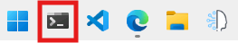
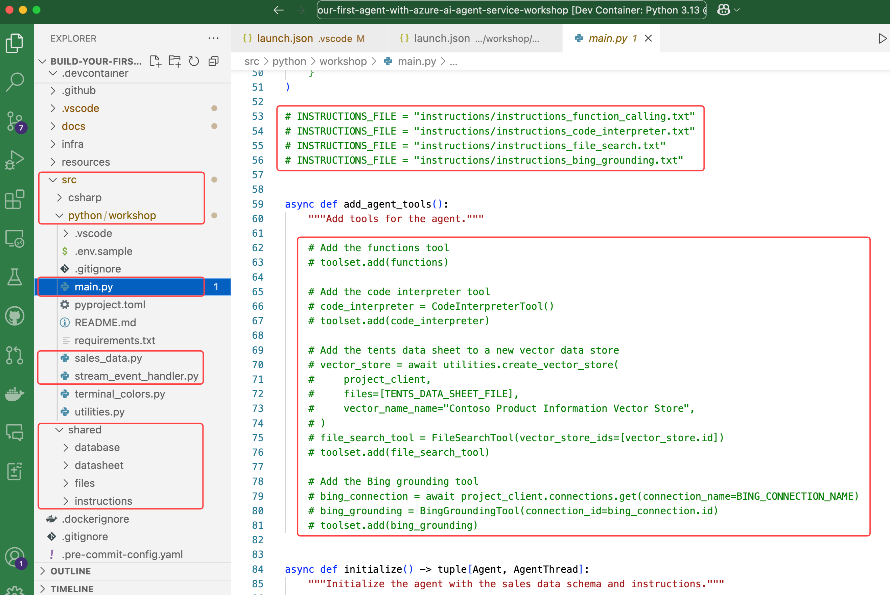
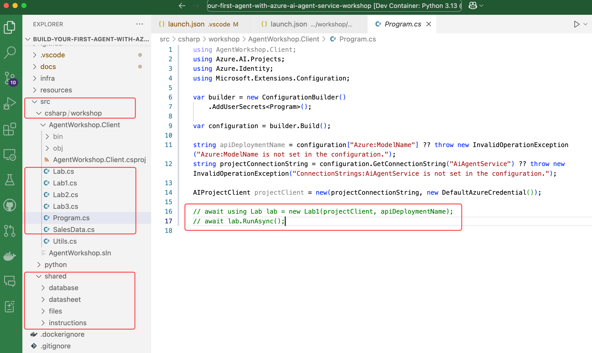

## Microsoft Build Attendees

The instructions on this page assume you are attending [Microsoft Build 2025](https://build.microsoft.com/){:target="_blank"} and have access to a pre-configured lab environment. This environment provides an Azure subscription with all the tools and resources needed to complete the workshop.

## Introduction

This workshop is designed to teach you about the Azure AI Agents Service and the associated [SDK](https://learn.microsoft.com/python/api/overview/azure/ai-projects-readme?context=%2Fazure%2Fai-services%2Fagents%2Fcontext%2Fcontext){:target="_blank"}. It consists of multiple labs, each highlighting a specific feature of the Azure AI Agents Service. The labs are meant to be completed in order, as each one builds on the knowledge and work from the previous lab.

## Select Workshop Programming Language

The workshop is available in both Python and C#. Please make sure to select the language that fits the lab room you are in, by using the language selector tabs. Note, don't switch languages mid-lab.

**Select the language tab that matches your lab room:**

=== "Python"
    The default language for the workshop is set to **Python**.
=== "C#"
    The default language for the workshop is set to **C#**.

## Authenticate with Azure

You need to authenticate with Azure so the agent app can access the Azure AI Agents Service and models. Follow these steps:

1. Open a terminal window. The terminal app is **pinned** to the Windows 11 taskbar.

    { width="300" }

2. Run the following command to authenticate with Azure:

    ```powershell
    az login
    ```

    !!! note
        You'll be prompted to open a browser link and log in to your Azure account.

        1. A browser window will open automatically, select **Work or school account** and click **Next**.

        1. Use the **Username** and **Password** found in the **top section** of the **Resources** tab in the lab environment.

        2. Select **OK**, then **Done**.

3. Then select the **Default** subscription from the command line, by clicking on **Enter**.

4. Once you've logged in, run the following command to assign the **user** role to the resource group:

    ```powershell
    $subId = $(az account show --query id --output tsv) `
    ;$objectId = $(az ad signed-in-user show --query id -o tsv) `
    ; az role assignment create --role "f6c7c914-8db3-469d-8ca1-694a8f32e121" --assignee-object-id $objectId --scope /subscriptions/$subId/resourceGroups/"rg-agent-workshop" --assignee-principal-type 'User'
    ```

5. Leave the terminal window open for the next steps.

## Open the Workshop

Follow these steps to open the workshop in Visual Studio Code:

=== "Python"

      1. From the terminal window, execute the following commands to clone the workshop repository, navigate to the relevant folder, set up a virtual environment, activate it, and install the required packages:

          ```powershell
          git clone https://github.com/microsoft/build-your-first-agent-with-azure-ai-agent-service-workshop.git `
          ; cd build-your-first-agent-with-azure-ai-agent-service-workshop `
          ; python -m venv src/python/workshop/.venv `
          ; src\python\workshop\.venv\Scripts\activate `
          ; pip install -r src/python/workshop/requirements.txt `
          ; code --install-extension tomoki1207.pdf
          ```

      2. Open in VS Code. From the terminal window, run the following command:

          ```powershell
          code .vscode\python-workspace.code-workspace
          ```

        !!! warning "When the project opens in VS Code, two notifications appear in the bottom right corner. Click ✖ to close both notifications."

=== "C#"

    1. From a terminal window, execute the following commands to clone the workshop repository:
    
        ```powershell
        git clone https://github.com/microsoft/build-your-first-agent-with-azure-ai-agent-service-workshop.git
        ```

    === "VS Code"

        1. Open the workshop in Visual Studio Code. From the terminal window, run the following command:

            ```powershell
            code build-your-first-agent-with-azure-ai-agent-service-workshop\.vscode\csharp-workspace.code-workspace
            ```

        !!! note "When the project opens in VS Code, a notification will appear in the bottom right corner to install the C# extension. Click **Install** to install the C# extension, as this will provide the necessary features for C# development."

    === "Visual Studio 2022"

        1. Open the workshop in Visual Studio 2022. From the terminal window, run the following command:

            ```powershell
            start build-your-first-agent-with-azure-ai-agent-service-workshop\src\csharp\workshop\AgentWorkshop.sln
            ```

            !!! note "You may be asked what program to open the solution with. Select **Visual Studio 2022**."

## Project Connection String

Next, we log in to Azure AI Foundry to retrieve the project connection string, which the agent app uses to connect to the Azure AI Agents Service.

1. Navigate to the [Azure AI Foundry](https://ai.azure.com){:target="_blank"} website.
2. Select **Sign in** and use the **Username** and **Password** found in the **top section** of the **Resources** tab in the lab environment. Click on the **Username** and **Password** fields to automatically fill in the login details.
    {:width="500"}
3. Read the introduction to the Azure AI Foundry and click **Got it**.
4. Ensure you are on the AI Foundry home page. Click the **AI Foundry** tab in the top left corner.

    {:width="200"}

5. Select the project name that starts with **aip-**.

    {:width="500"}

6. Review the introduction guide and click **Close**.
7. Locate the **Project details** section, click the **Copy** icon to copy the **Project connection string**.

    {:width="500"}

=== "Python"

    ## Configure the Workshop

    1. Switch back to the workshop you opened in VS Code.
    2. **Rename** the `.env.sample` file to `.env`.

        - Select the **.env.sample** file in the VS Code **Explorer** panel.
        - Right-click the file and select **Rename**, or press <kbd>F2</kbd>.
        - Change the file name to `.env` and press <kbd>Enter</kbd>.

    3. Paste the **Project connection string** you copied from Azure AI Foundry into the `.env` file.

        ```python
        PROJECT_CONNECTION_STRING="<your_project_connection_string>"
        ```

        Your `.env` file should look similar to this but with your project connection string.

        ```python
        MODEL_DEPLOYMENT_NAME="gpt-4o"
        BING_CONNECTION_NAME="groundingwithbingsearch"
        PROJECT_CONNECTION_STRING="<your_project_connection_string>"
        ```

    4. Save the `.env` file.

    ## Project Structure

    Be sure to familiarize yourself with the key **subfolders** and **files** you’ll be working with throughout the workshop.

    5. The **main.py** file: The entry point for the app, containing its main logic.
    6. The **sales_data.py** file: The function logic to execute dynamic SQL queries against the SQLite database.
    7. The **stream_event_handler.py** file: Contains the event handler logic for token streaming.
    8. The **shared/files** folder: Contains the files created by the agent app.
    9. The **shared/instructions** folder: Contains the instructions passed to the LLM.

    

=== "C#"

    ## Configure the Workshop

    1. Open a terminal and navigate to the **src/csharp/workshop/AgentWorkshop.Client** folder.

        ```powershell
        cd build-your-first-agent-with-azure-ai-agent-service-workshop\src\csharp\workshop\AgentWorkshop.Client
        ```

    2. Add the **Project connection string** you copied from Azure AI Foundry to the user secrets.

        ```powershell
        dotnet user-secrets set "ConnectionStrings:AiAgentService" "<your_project_connection_string>"
        ```
    
    3. Add the **Model deployment name** to the user secrets.

        ```powershell
        dotnet user-secrets set "Azure:ModelName" "gpt-4o"
        ```

    ## Project Structure

    Be sure to familiarize yourself with the key **subfolders** and **files** you’ll be working with throughout the workshop.

    ### The workshop folder

    - The **Lab1.cs, Lab2.cs, Lab3.cs** files: The entry point for each lab, containing its agent logic.
    - The **Program.cs** file: The entry point for the app, containing its main logic.
    - The **SalesData.cs** file: The function logic to execute dynamic SQL queries against the SQLite database.

    ### The shared folder

    - The **files** folder: Contains the files created by the agent app.
    - The **fonts** folder: Contains the multilingual fonts used by Code Interpreter.
    - The **instructions** folder: Contains the instructions passed to the LLM.

    

## Pro Tips

!!! tips
    1. The **Burger Menu** in the right-hand panel of the lab environment offers additional features, including the **Split Window View** and the option to end the lab. The **Split Window View** allows you to maximize the lab environment to full screen, optimizing screen space. The lab's **Instructions** and **Resources** panel will open in a separate window.
    2. If the lab instructions are slow to scroll in the lab environment, try copying the instructions’ URL and opening it in **your computer’s local browser** for a smoother experience.
    3. If you have trouble viewing an image, simply **click the image to enlarge it**.
