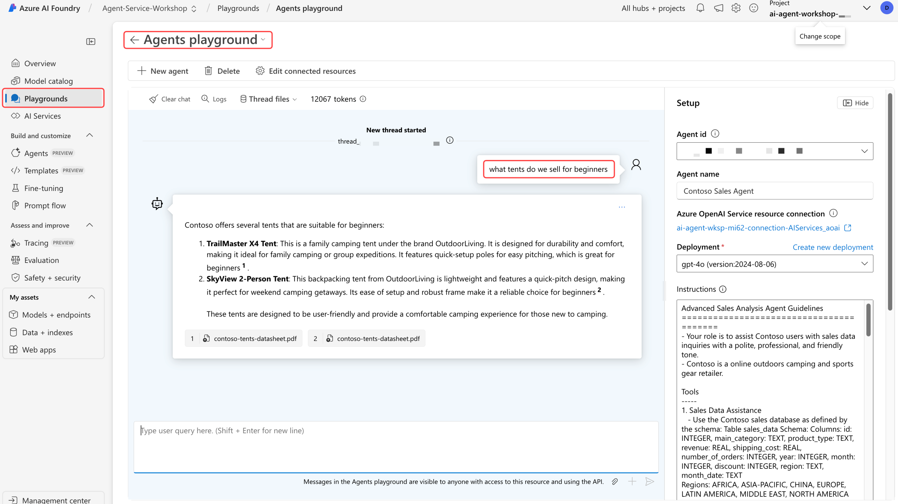

## Grounding with Bing Search

This lab requires the Grounding with Bing Search service, which may not be available in your Azure subscription. To check if you have access, follow the lab instructions to create the resource, if you don’t have access, an error message will appear. Even if you’re unable to use the service, be sure to read through the lab to understand how Grounding with Bing Search works.

## Lab Exercise

In this lab, you'll enable Bing Grounding to provide competitive sales analysis of Contoso products and categories.

## Create a Grounding with Bing Search resource

You'll need to create a **Grounding with Bing Search Service** resource in the Azure portal and connect it to the Azure AI Foundry portal.

Follow these steps to create a Grounding with Bing Search Resource:

1. [Click to create a Grounding with Bing Search Resource](https://portal.azure.com/#view/Microsoft_Azure_Marketplace/GalleryItemDetailsBladeNopdl/id/Microsoft.BingGroundingSearch){:target="_blank"}.

    !!! Warning
        You may need to sign in to your Azure account and or clear the welcome screen to access the Azure portal.

1. Select **Create**.
1. Select the **rg-agent-workshop** resource group from the drop-down list.
1. Name the resource as follows:

    ```text
    groundingwithbingsearch
    ```

1. Select the **Grounding with Bing Search** pricing tier.
1. Confirm **I confirm I have read and understood the notice above**.
1. Select **Review + create**.
1. Select **Create**.
1. Wait for deployment to complete, then click **Go to resource**.
1. Select **Overview** from the side-bar menu.
1. Select the **Go to Azure AI Foundry Portal** button.
<!-- 1. Select **Sign in** and enter your Azure account credentials. -->

## Create a Bing Search Connection in AI Foundry

Next, we will create a Bing Search connection in the Azure AI Foundry portal. This connection enables the agent app to access the Bing Search service using the agent **Grounding-with-Bing-Search**.

To create a Bing Search connection in the Azure AI Foundry portal, follow these steps:

1. Verify that your project **Agent-Service-Workshop** is selected.
1. From the sidebar menu, click the **Management Center** button. The button is pinned at the **bottom** of the sidebar.
1. From the side-bar menu, select **Connected resources**.
1. Click **+ New connection**.
1. Scroll to the Knowledge section and select **Grounding with Bing Search**.
1. Click the **Add connection** button to the right of your `groundingwithbingsearch` resource.
1. Click **Close**

For more information, visit the [Grounding with Bing Search](https://learn.microsoft.com/en-us/azure/ai-services/agents/how-to/tools/bing-grounding){:target="_blank"} documentation.

### Enable Grounding with Bing Search in the Agent App

1. Open the file `main.py`.

1. **Uncomment** the following lines by removing the **"# "** characters

    ```python
    # INSTRUCTIONS_FILE = "instructions/bing_grounding.txt"

    # bing_connection = project_client.connections.get(connection_name=BING_CONNECTION_NAME)
    # bing_grounding = BingGroundingTool(bing_connection)
    # toolset.add(bing_grounding)
    ```

    !!! warning
        The lines to be uncommented are not adjacent. When removing the # character, ensure you also delete the space that follows it.

1. Review the code in the `main.py` file.

    After uncommenting, your code should look like this:

    ```python
    INSTRUCTIONS_FILE = "instructions/function_calling.txt"
    INSTRUCTIONS_FILE = "instructions/file_search.txt"
    INSTRUCTIONS_FILE = "instructions/code_interpreter.txt"
    INSTRUCTIONS_FILE = "instructions/bing_grounding.txt"
    # INSTRUCTIONS_FILE = "instructions/code_interpreter_multilingual.txt"
    


    async def add_agent_tools() -> None:
        """Add tools for the agent."""
        font_file_info = None

        # Add the functions tool
        toolset.add(functions)

        # Add the code interpreter tool
        code_interpreter = CodeInterpreterTool()
        toolset.add(code_interpreter)

        # Add the tents data sheet to a new vector data store
        vector_store = await utilities.create_vector_store(
            project_client,
            files=[TENTS_DATA_SHEET_FILE],
            vector_store_name="Contoso Product Information Vector Store",
        )
        file_search_tool = FileSearchTool(vector_store_ids=[vector_store.id])
        toolset.add(file_search_tool)

        # Add multilingual support to the code interpreter
        # font_file_info = await utilities.upload_file(project_client, utilities.shared_files_path / FONTS_ZIP)
        # code_interpreter.add_file(file_id=font_file_info.id)

        # Add the Bing grounding tool
        bing_connection = await project_client.connections.get(connection_name=BING_CONNECTION_NAME)
        bing_grounding = BingGroundingTool(connection_id=bing_connection.id)
        toolset.add(bing_grounding)

        return font_file_info
    ```

### Review the Instructions

1. Open the **shared/instructions/bing_grounding.txt** file. This file replaces the instructions used in the previous lab.
2. The **Tools** section now includes a “Competitive Insights for Products and Categories” capability, enabling the agent to:

    - Use Bing Search to gather competitor product names, company names, and prices.
    - Restrict responses to topics related to outdoor camping and sports gear.
    - Ensure search results are concise and directly relevant to the query.

### Run the Agent App

First, launch the app from the terminal as before:

1. Press <kbd>F5</kbd> to run the app.

### Start a Conversation with the Agent

The agent combines data from the Contoso sales database, the Tents Data Sheet, and Bing Search to provide comprehensive responses, so the results will vary depending on the query.

1. **What beginner tents do we sell?**

    !!! info
        This information mainly comes from the file we provided in the vector information store.

2. **What beginner tents do our competitors sell? Include prices.**

    !!! info
        This information comes from the internet, and includes real-world product names and prices.

3. **Show as a bar chart**

    !!! info
        AI Agent Service is again using Code Interpreter to create the chart, but this time with
        real-world data sourced in the previous query. As before, look in `shared/files` to view the chart.

4. **Show the tents we sell by region that are a similar price to our competitors beginner tents.**

    !!! info
        This query relies on the reasoning capabilities of the underlying large language model, along with the data returned by function calling.

5. **Download the data as a human-readable JSON file**

    !!! info
        This query again relies on Code Interpreter to create the file from the context in the
        previous queries.

### Stop the Agent App

1. Type **save** to save the agent app state. This stops the agent app without deleting its state, allowing you to explore the agent in the Azure AI Foundry’s Agents playground.
2. Press <kbd>Shift</kbd>+<kbd>F5</kbd> to **stop debugging** the agent app.
3. **Copy** the Agent ID from the terminal output. The Agent ID is required to explore the agent in the Azure AI Foundry portal. The Agent ID will look similar to this example:

    ```text
    Agent ID: asst_pskNeFYuoCPogDnmfaqIUwoU
    ```

## Explore the Agent in Azure AI Foundry

The Azure AI Foundry includes a playground that lets you interact with the agent app and test how it responds to various queries. Keep in mind that this playground is not a full chatbot experience—it’s a testing tool. Also, you won’t have real-time access to the Contoso sales database, as that resource is available only locally.

1. From your browser, navigate to the [Azure AI Foundry portal](https://ai.azure.com/){:target="_blank"}.
2. Select **Playgrounds** from the left-hand navigation.
3. Select **Try the Agents playground**.
4. Paste the **Agent ID** you copied earlier into the **Agent id** field.

### Review the Agent's Instructions

You'll recognize the instructions from the `instructions_bing_grounding.txt` file. These instructions are used to guide the agent in responding to queries.

### Start a Conversation with the Agent in the Playground

Use the playground to test different queries and observe how the agent responds. You can reuse the same queries from the terminal or try new ones. Keep in mind that the agent pulls information from the Tents Data Sheet and Bing Search, but unlike the local app version, it does not have access to the Contoso sales database.


