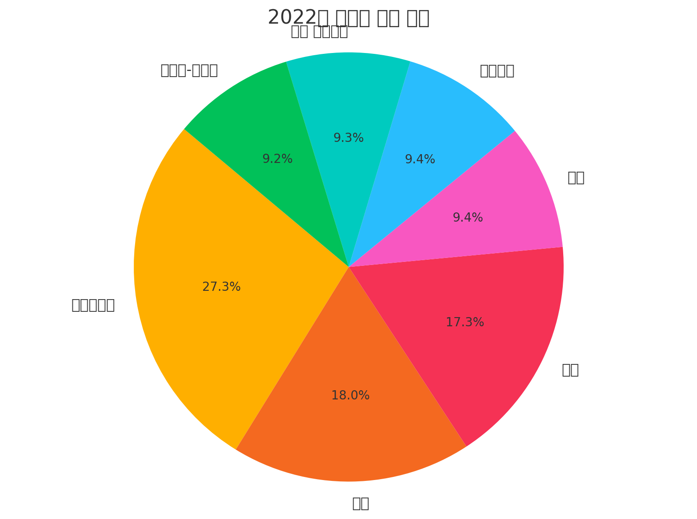
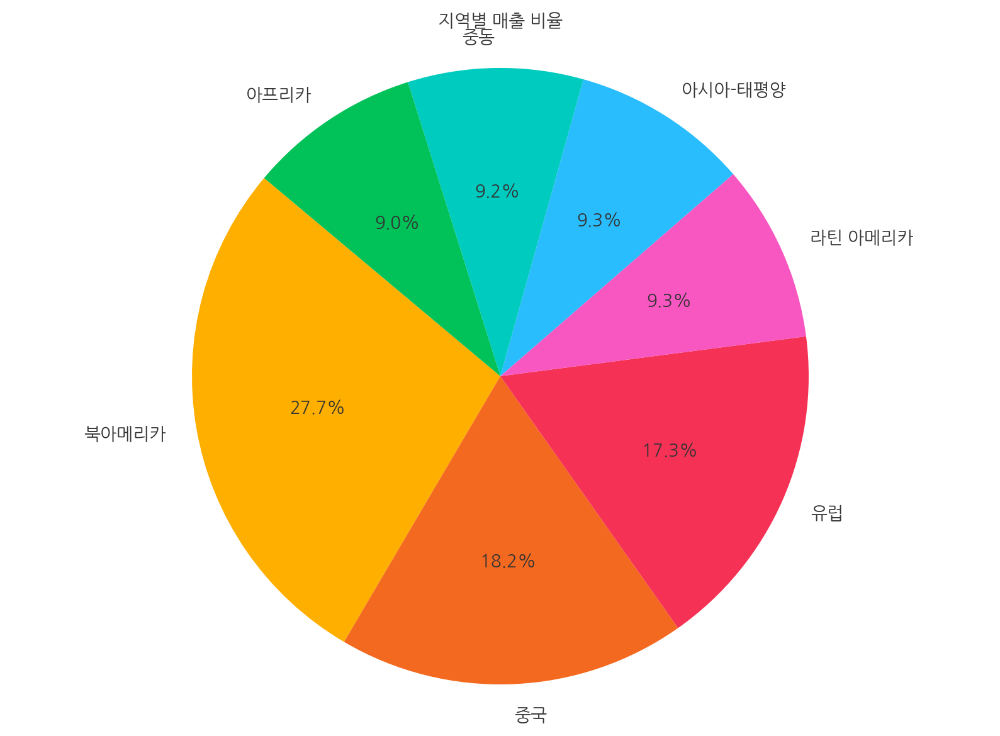

## Introduction

In the Grounding with Documents lab, we uploaded a PDF file to provide context for conversations. Now, we’ll enhance the Code Interpreter by uploading a ZIP file with fonts for multilingual visualizations—just one example of how [file uploads](https://learn.microsoft.com/azure/ai-services/agents/how-to/tools/code-interpreter){:target="_blank"} can extend its functionality.

!!! note
    The Code Interpreter includes a default set of Latin-based fonts. Since the Code Interpreter runs in a sandboxed Python environment, it can’t download fonts directly from the internet.

## Lab Exercise

Earlier labs didn’t include multilingual support because uploading the required font ZIP file and linking it to the Code Interpreter is time-consuming. In this lab, we’ll enable multilingual support by uploading the necessary fonts. You’ll also learn some tips on how to guide the Code Interpreter using extended instructions.

## Rerun the previous lab

First, we're going to rerun the previous lab so we can see how the Code Interpreter supports multilingual text.

1. Start the agent app by pressing <kbd>F5</kbd>.
2. In the terminal, the app will start, and the agent app will prompt you to  **Enter your query**.
3. Try these questions:

      1. **What were the sales by region for 2022**
      2. **In Korean**
      3. **Show as a pie chart**

Once the task is complete, the pie chart image will be saved in the **shared/files** subfolder. Review the visualization, and you'll see that the text is not rendered correctly. This is because the Code Interpreter doesn't have the necessary fonts to render non-Latin characters.

{width=75%}

4. When you're done, type **exit** to clean up the agent resources and stop the app.

## Add Multilingual Font Support

=== "Python"

    1. Open the `main.py`.

    2. Define a new instructions file for our agent: **uncomment** the following lines by removing the **"# "** characters

        ```python
        INSTRUCTIONS_FILE = "instructions/code_interpreter_multilingual.txt"

        font_file_info = await utilities.upload_file(project_client, utilities.shared_files_path / FONTS_ZIP)
        code_interpreter.add_file(file_id=font_file_info.id)
        ```

        !!! warning
            The lines to be uncommented are not adjacent. When removing the # character, ensure you also delete the space that follows it.

    3. Review the code in the `main.py` file.

        After uncommenting, your code should look like this:

        ```python
        INSTRUCTIONS_FILE = "instructions/function_calling.txt"
        INSTRUCTIONS_FILE = "instructions/file_search.txt"
        INSTRUCTIONS_FILE = "instructions/code_interpreter.txt"
        INSTRUCTIONS_FILE = "instructions/bing_grounding.txt"
        INSTRUCTIONS_FILE = "instructions/code_interpreter_multilingual.txt"


        async def add_agent_tools() -> None:
            """Add tools for the agent."""
            font_file_info = None

            # Add the functions tool
            toolset.add(functions)

            # Add the code interpreter tool
            code_interpreter = CodeInterpreterTool()
            toolset.add(code_interpreter)

            # Add the tents data sheet to a new vector data store
            vector_store = await utilities.create_vector_store(
                project_client,
                files=[TENTS_DATA_SHEET_FILE],
                vector_store_name="Contoso Product Information Vector Store",
            )
            file_search_tool = FileSearchTool(vector_store_ids=[vector_store.id])
            toolset.add(file_search_tool)

            # Add multilingual support to the code interpreter
            font_file_info = await utilities.upload_file(project_client, utilities.shared_files_path / FONTS_ZIP)
            code_interpreter.add_file(file_id=font_file_info.id)

            # Add the Bing grounding tool
            bing_connection = await project_client.connections.get(connection_name=BING_CONNECTION_NAME)
            bing_grounding = BingGroundingTool(connection_id=bing_connection.id)
            toolset.add(bing_grounding)

            return font_file_info
        ```

=== "C#"

    1. Open the `Program.cs` file.

    2. **Update** the creation of the lab to use the `Lab2` class.

        ``` csharp
        await using Lab lab = new Lab5(projectClient, apiDeploymentName);
        ```

    3. Review the `Lab4.cs` class to see how the Code Interpreter is added to the Tools list.

## Review the Instructions

1. Open the **shared/instructions/code_interpreter_multilingual.txt** file. This file replaces the instructions used in the previous lab.
2. The **Tools** section now includes an extended “Visualization and Code Interpretation” section describing how to create visualizations and handle non-Latin languages.

    The following is a summary of the instructions given to the Code Interpreter:

    - **Font Setup for Non-Latin Scripts (e.g., Arabic, Japanese, Korean, Hindi):**
        - On first run, verify if the `/mnt/data/fonts` folder exists. If missing, unzip the font file into this folder.
    - **Available Fonts:**
        - Arabic: `CairoRegular.ttf`
        - Hindi: `NotoSansDevanagariRegular.ttf`
        - Korean: `NanumGothicRegular.ttf`
        - Japanese: `NotoSansJPRegular.ttf`

    - **Font Usage:**
        - Load the font with `matplotlib.font_manager.FontProperties` using the correct path.
        - Apply the font to:
            - `plt.title()` using the `fontproperties` parameter.
            - All labels and text using `textprops={'fontproperties': font_prop}` in functions like `plt.pie()` or `plt.bar_label()`.
        - Ensure all text (labels, titles, legends) is properly encoded, without boxes or question marks.

    - **Visualization Text:**
        - Always translate the data to the requested or inferred language (e.g., Chinese, French, English).
        - Use the appropriate font from `/mnt/data/fonts/fonts` for all chart text (e.g., titles, labels).

## Run the Agent App

1. Press <kbd>F5</kbd> to run the app.
2. In the terminal, the app will start, and the agent app will prompt you to  **Enter your query**.

### Start a Conversation with the Agent

Try these questions:

1. **What were the sales by region for 2022**
2. **In Korean**
3. **Show as a pie chart**

    Once the task is complete, the pie chart image will be saved in the **shared/files** subfolder.

    {width=75%}

## Debugging the Code Interpreter

You can’t directly debug the Code Interpreter, but you can gain insight into its behavior by asking the agent to display the code it generates. This helps you understand how it interprets your instructions and can guide you in refining them.

From the terminal, type:

1. **show code** to see the code generated by the Code Interpreter for the last visualization.
1. **list files mounted at /mnt/data** to see the files uploaded to the Code Interpreter.

## Restricting Code Interpreter Output

In a production environment, you likely don’t want end users to see the code generated by the Code Interpreter or access uploaded or created files. To prevent this, add instructions to restrict the Code Interpreter from displaying code or listing files.

For example, you can insert the following instructions at the beginning of the `2. Visualization and Code Interpretation` section in the `code_interpreter_multilingual.txt` file.

```text
- Never show the code you generate to the user.
- Never list the files mounted at /mnt/data.
```

## Stop the Agent App

When you're done, type **exit** to clean up the agent resources and stop the app.
